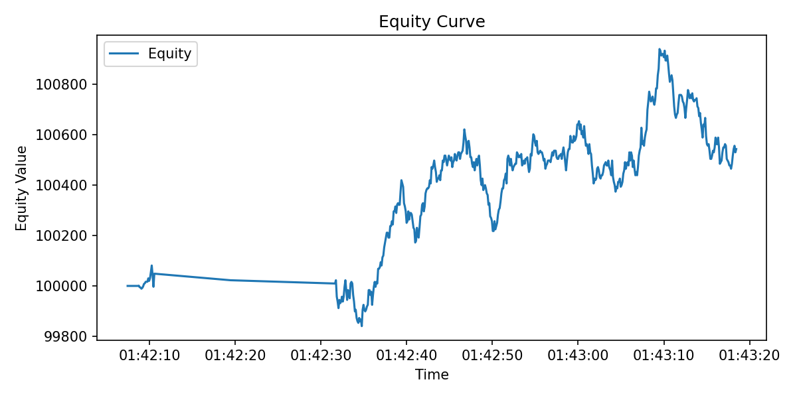

# Performance Report

## Summary metrics

| Metric | Value |
|:--|--:|
| Total return | -35.26% |
| Sharpe ratio (annualized) | -0.999 |
| Max drawdown | 39.43% |
| Observations | 500 |
| Start | 2025-09-21 20:32:34.145897 |
| End | 2025-09-21 20:32:39.438957 |

## Equity curve (Embedded PNG)

